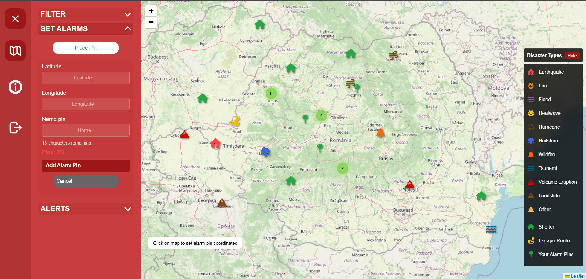

# Crisis Containment Service (CRI)

<div align="center">


**A comprehensive web-based disaster management and alert system**

[](https://opensource.org/licenses/MIT)
[](https://nodejs.org/)
[](https://www.mysql.com/)
[](https://developer.mozilla.org/en-US/docs/Web/JavaScript)
[](https://developer.mozilla.org/en-US/docs/Web/API/WebSockets_API)

[Demo](#demo) • [Features](#features) • [Installation](#installation) • [Usage](#usage) • [API Documentation](#api-reference) • [Contributing](#contributing)

</div>

---

## 📋 Table of Contents

- [About](#about)
- [Features](#features)
- [Tech Stack](#tech-stack)
- [Architecture](#architecture)
- [Installation](#installation)
- [Usage](#usage)
- [API Reference](#api-reference)
- [Environment Variables](#environment-variables)
- [Screenshots](#screenshots)
- [Contributing](#contributing)
- [License](#license)
- [Contact](#contact)
- [Acknowledgments](#acknowledgments)

## 🎯 About

Crisis Containment Service (CRI) is a comprehensive disaster management platform designed to provide real-time alerts and emergency response coordination. The system serves both civilian users and emergency authorities, offering role-based access to disaster information, shelter management, and personalized alert systems.

### Key Capabilities:
- **Real-time Disaster Monitoring**: Integration with USGS, NASA, and UK Environment Agency APIs
- **Personalized Alert System**: Location-based notifications using CAP (Common Alerting Protocol)
- **Interactive Mapping**: Leaflet.js-powered maps with disaster visualization
- **Role-based Access**: Separate interfaces for civilians and emergency authorities
- **Shelter Management**: Emergency shelter coordination and escape route planning

## ✨ Features

### 🏠 For Civilians
- **Personal Alert Pins**: Set up to 3 personal locations for customized disaster alerts
- **Real-time Notifications**: Instant WebSocket-based alerts for nearby disasters
- **Interactive Maps**: View disasters, shelters, and escape routes in your area
- **Alert History**: Access to recent alerts and CAP XML files
- **Mobile Responsive**: Works seamlessly on all devices

### 🚨 For Emergency Authorities
- **Disaster Management**: Create, update, and delete disaster records
- **Shelter Coordination**: Manage emergency shelters and escape routes
- **Alert Broadcasting**: Send targeted alerts to affected populations
- **Real-time Dashboard**: Monitor ongoing disasters and response efforts
- **CAP Alert Generation**: Automatic generation of standardized emergency alerts

### 🔧 Technical Features
- **Real-time Communication**: WebSocket-based instant notifications
- **External API Integration**: Live data from earthquake, flood, and fire monitoring systems
- **Security**: Input validation, XSS protection, and secure authentication
- **CAP Compliance**: Standard emergency alert protocol implementation
- **Scalable Architecture**: Modular design for easy maintenance and expansion

## 🛠️ Tech Stack

### Frontend
- **HTML5/CSS3**: Modern responsive design
- **JavaScript (ES6+)**: Interactive functionality
- **Leaflet.js**: Interactive mapping and geospatial visualization
- **WebSocket API**: Real-time communication

### Backend
- **Node.js**: Server-side JavaScript runtime
- **HTTP Module**: Native Node.js web server (not Express)
- **MySQL**: Relational database management
- **WebSocket**: Real-time bidirectional communication server
- **BCrypt**: Password hashing and security
- **CAP Alert Generator**: Custom module for emergency alerts

### External Integrations
- **USGS Earthquake API**: Real-time earthquake data
- **UK Environment Agency API**: Flood monitoring data
- **NASA Fires API**: Wildfire tracking data
- **XMLBuilder2**: CAP alert generation

### Development Tools
- **Git**: Version control
- **npm**: Package management
- **MySQL Workbench**: Database design and management

## 🏗️ Architecture

The system follows a **three-tier architecture** with clear separation of concerns:

```
┌─────────────────┐    ┌──────────────────┐    ┌─────────────────┐
│  Presentation   │    │   Application    │    │      Data       │
│     Layer       │    │      Layer       │    │     Layer       │
├─────────────────┤    ├──────────────────┤    ├─────────────────┤
│ • HTML/CSS/JS   │◄──►│ • Node.js Server │◄──►│ • MySQL Database│
│ • Leaflet Maps  │    │ • WebSocket      │    │ • CAP XML Files │
│ • WebSocket     │    │ • API Endpoints  │    │ • External APIs │
│ • Responsive UI │    │ • Authentication │    │                 │
└─────────────────┘    └──────────────────┘    └─────────────────┘
```

### C4 Architecture Diagrams & Documentation
Detailed C4 model diagrams are available in the [C4Diagrams](./C4Diagrams/).
Detailed documentation is in [SRS_Document](./SRS_Document.html).

## 🚀 Installation

### Prerequisites
- **Node.js** (v18.x or higher)
- **MySQL** (v8.0 or higher)
- **npm** (v9.x or higher)

### Step-by-step Installation

1. **Clone the repository**
   ```bash
   git clone https://github.com/yourusername/Web-Technologies-Project.git
   cd Web-Technologies-Project
   ```

2. **Install dependencies**
   ```bash
   npm install
   ```

3. **Set up MySQL database**
   ```bash
   # Create database and tables
   mysql -u root -p < database-schema/init.sql
   ```

4. **Configure database connection**
   ```javascript
   // Update database credentials in server.js
   const db = mysql.createPool({
     host: 'localhost',
     user: 'root',
     password: '1234',
     database: 'web',
     port: 3306
   });
   ```

5. **Start the application**
   ```bash
   # Start main server (port 3000)
   node server.js

5. **Deploy to Google Cloud Run**
   
   Build and push the Docker image:
   ```bash
   gcloud builds submit --tag gcr.io/cogent-range-463901-a8/web
   ```
   
   Deploy to Cloud Run:
   ```bash
   gcloud run deploy cri-service \
     --image gcr.io/cogent-range-463901-a8/web \
     --platform managed \
     --region europe-west1 \
     --allow-unauthenticated \
     --port 3000 \
     --set-env-vars DB_HOST=35.205.50.78,DB_USER=root,DB_PASS=1234,DB_NAME=web,DB_PORT=3306
   ```
   

6. **Access the application**
   - **Local**: Open your browser and navigate to `http://localhost:3000`
   - **Production**: Navigate to `https://cri-service-615568581212.europe-west1.run.app/`
   - Create an account or log in with existing credentials

## 💻 Usage

### For Civilians

1. **Registration**: Create an account with your email
2. **Set Personal Pins**: Add up to 3 important locations (home, work, family)
3. **Monitor Alerts**: Receive real-time notifications for nearby disasters
4. **View Maps**: Explore interactive maps showing disasters and shelters
5. **Access History**: Review recent alerts and download CAP XML files

### For Emergency Authorities

1. **Authority Access**: Register with an email ending in `@cri.com`
2. **Manage Disasters**: Create and update disaster records with location and severity
3. **Coordinate Shelters**: Add emergency shelters and escape routes
4. **Monitor Response**: Track ongoing disasters and affected populations
5. **Generate Alerts**: Automatic CAP alert generation for affected users

### Authentication System

- **Civilian Users**: Standard email registration
- **Authority Users**: Email must end with `@cri.com` for administrative access
- **Session Management**: 24-hour cookie-based sessions
- **Role-based Routing**: Automatic redirection to appropriate dashboards

## 📡 API Reference

### Authentication Endpoints

#### Register User
```http
POST /api/signup
Content-Type: application/json

{
  "email": "user@example.com",
  "password": "SecurePassword123"
}
```

#### Login User
```http
POST /api/login
Content-Type: application/json

{
  "email": "user@example.com",
  "password": "SecurePassword123"
}
```

#### Get Current User
```http
GET /api/user
Cookie: userEmail=user@example.com
```

### Disaster Management

#### Get All Disasters
```http
GET /calamities
Cookie: userEmail=user@example.com
```

#### Create Disaster (Authority Only)
```http
POST /calamities
Content-Type: application/json
Cookie: userEmail=authority@cri.com

{
  "lat": 45.9432,
  "lng": 24.9668,
  "type": "earthquake",
  "description": "Moderate earthquake detected",
  "gravity": "medium",
  "startdate": "2024-01-15T10:30:00",
  "enddate": "2024-01-15T11:00:00"
}
```

### External Data Endpoints

#### Get Earthquake Data
```http
GET /earthquakes
Cookie: userEmail=user@example.com
```

#### Get Flood Data
```http
GET /floods
Cookie: userEmail=user@example.com
```

### Personal Pins (Civilians Only)

#### Get User Pins
```http
GET /client-pins/{userId}
Cookie: userEmail=user@example.com
```

#### Create/Update Pin
```http
POST /client-pins
Content-Type: application/json

{
  "id_client": 1,
  "pin_slot": 1,
  "lat": 45.9432,
  "lng": 24.9668,
  "name": "Home"
}
```

### WebSocket Events

#### Connect to WebSocket
```javascript
const ws = new WebSocket('ws://localhost:3001');
ws.send(JSON.stringify({ userId: 1 }));
```

#### Receive Alert
```javascript
ws.onmessage = (event) => {
  const alert = JSON.parse(event.data);
  // Handle real-time alert
};
```

## 🔧 Environment Variables

Create a `.env` file in the root directory:

```env
# Database Configuration
DB_HOST=localhost
DB_USER=root
DB_PASSWORD=your_password
DB_NAME=web
DB_PORT=3306

# Server Configuration
PORT=3000


# Security
BCRYPT_SALT_ROUNDS=10

# External APIs (Optional - for custom endpoints)
USGS_API_URL=https://earthquake.usgs.gov/fdsnws/event/1/query
NASA_API_URL=https://firms.modaps.eosdis.nasa.gov/api/area/csv
NASA_API_KEY=your_nasa_api_key_here
UK_ENV_API_URL=https://environment.data.gov.uk/flood-monitoring/id/floods
```

## 📱 Screenshots

### Civilian Dashboard

*Interactive map showing disasters, shelters, and personal alert pins*

### Authority Dashboard

*Administrative interface for disaster and shelter management*

### Real-time Alerts

*WebSocket-based real-time alert notifications*

### Mobile Responsive

*Fully responsive design for mobile devices*


### System Architecture
The application consists of multiple components working together:
- **Main Server** (`server.js`) - HTTP server on port 3000
- **CAP Alert Generator** (`generateCapAlerts.js`) - Emergency alert creation
- **Database Schema** (`database-schema/init.sql`) - MySQL table structure

## 🤝 Contributing

Contributions are welcome! Please follow these steps:

1. **Fork the Project**
2. **Create your Feature Branch** (`git checkout -b feature/AmazingFeature`)
3. **Commit your Changes** (`git commit -m 'Add some AmazingFeature'`)
4. **Push to the Branch** (`git push origin feature/AmazingFeature`)
5. **Open a Pull Request**

### Development Guidelines

- Follow JavaScript ES6+ standards
- Use meaningful commit messages
- Add comments for complex logic
- Test thoroughly before submitting
- Update documentation as needed


## 📄 License

This project is licensed under the MIT License - see the [LICENSE](LICENSE) file for details.

```
MIT License

Copyright (c) 2024 Crisis Containment Service

Permission is hereby granted, free of charge, to any person obtaining a copy
of this software and associated documentation files (the "Software"), to deal
in the Software without restriction, including without limitation the rights
to use, copy, modify, merge, publish, distribute, sublicense, and/or sell
copies of the Software, and to permit persons to whom the Software is
furnished to do so, subject to the following conditions:

The above copyright notice and this permission notice shall be included in all
copies or substantial portions of the Software.

THE SOFTWARE IS PROVIDED "AS IS", WITHOUT WARRANTY OF ANY KIND, EXPRESS OR
IMPLIED, INCLUDING BUT NOT LIMITED TO THE WARRANTIES OF MERCHANTABILITY,
FITNESS FOR A PARTICULAR PURPOSE AND NONINFRINGEMENT. IN NO EVENT SHALL THE
AUTHORS OR COPYRIGHT HOLDERS BE LIABLE FOR ANY CLAIM, DAMAGES OR OTHER
LIABILITY, WHETHER IN AN ACTION OF CONTRACT, TORT OR OTHERWISE, ARISING FROM,
OUT OF OR IN CONNECTION WITH THE SOFTWARE OR THE USE OR OTHER DEALINGS IN THE
SOFTWARE.
```

## 📞 Contact

**Project Maintainer**: Your Name
- Email: sarahbuligamarga@gmail.com
- Email: dragos.martinas@gmail.com


**Project Link**: https://github.com/dragosh10/Web-Technologies-Project

## 🙏 Acknowledgments

- **[USGS](https://earthquake.usgs.gov/)** - Real-time earthquake data
- **[UK Environment Agency](https://environment.data.gov.uk/)** - Flood monitoring data
- **[NASA](https://firms.modaps.eosdis.nasa.gov/api/)** - Fire and thermal anomaly data
- **[Leaflet.js](https://leafletjs.com/)** - Interactive mapping library
- **[Common Alerting Protocol (CAP)](https://docs.oasis-open.org/emergency/cap/v1.2/)** - Emergency alert standards
- **[XMLBuilder2](https://github.com/oozcitak/xmlbuilder2)** - XML generation library
- **[BCrypt](https://github.com/kelektiv/node.bcrypt.js)** - Password hashing library

---

<div align="center">


</div>
